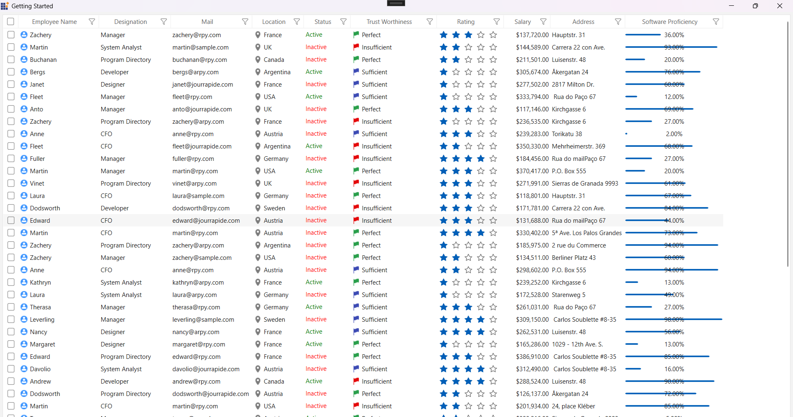

# How to set visual style using SkinManager?

This sample loads [Datagrid](https://help.syncfusion.com/wpf/datagrid/getting-started) and [Chromeless Window](https://help.syncfusion.com/wpf/chromeless-window/getting-started) with theme look using SkinManager [VisualStyle](https://help.syncfusion.com/wpf/themes/skin-manager#set-visual-style) support. 

