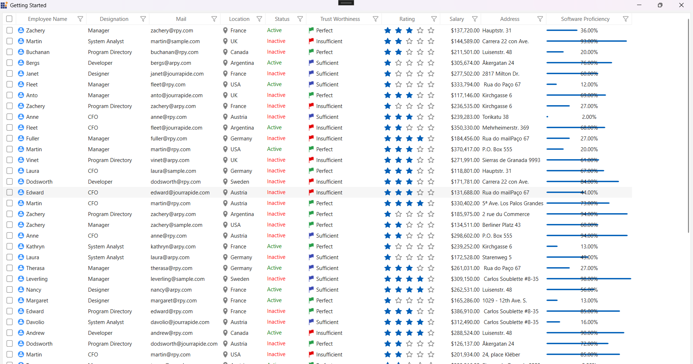

# How to apply theme using WPF SkinManager?

This sample loads [Datagrid](https://help.syncfusion.com/wpf/datagrid/getting-started) and Window and applies Windows11Light theme.

## Overview

The WPF SkinManager is a comprehensive theming solution that enables developers to apply modern, professional themes to their Windows Presentation Foundation applications with minimal effort. This sample demonstrates the seamless integration of the Windows11Light theme across multiple controls.

## What is Windows11Light Theme?

Windows11Light is a contemporary theme that mirrors the clean, modern aesthetic of Windows 11's design language. It features subtle shadows, rounded corners, and a light color palette that provides excellent readability and a polished user experience.

## Key Features

- Simple Theme Application: Apply themes with just a few lines of code using the SkinManager API.
- Consistent Styling: Automatically style all Syncfusion controls throughout your application.
- DataGrid Enhancement: Transform your DataGrid with modern visuals including updated headers, cells, and selection styles.
- Window Integration: Extend theming to the entire window chrome for a unified appearance.

## Benefits

Using SkinManager eliminates the need for manual XAML styling, reduces development time, and ensures visual consistency across your entire application.

